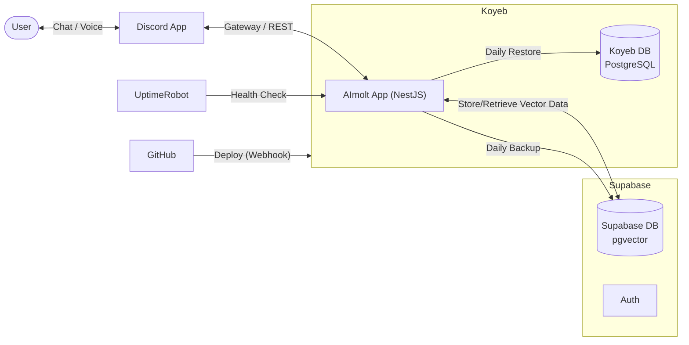
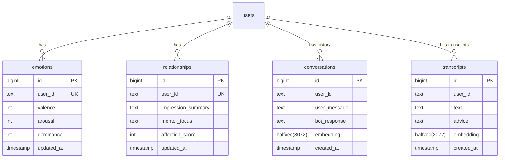

# AImolt Discord Bot

AImoltは、**Gemini** と **Supabase** を活用した、高度な対話能力と長期記憶を持つDiscordボットです。
**NestJS** で構築されており、**Koyeb** 上で常駐プロセスとして動作します。

## 🚀 主な機能

### 1. 💬 高度な対話 (Gemini API)
- **リアクション操作**:
    - **👍 (Like)**: 通常の会話モード。テキストへの返信や、音声の文字起こし＋アドバイスを行います（履歴保存・人格更新あり）。
    - **👻 (Ghost)**: 一時的な会話モード。テキストへの返信や、音声の文字起こし＋アドバイスを行いますが、履歴や人格には影響しません。
    - **🎤 (Mic)**: 文字起こし専用モード。音声ファイルの文字起こしのみを行います（アドバイスなし・履歴保存なし）。
- **対応音声形式**: mp3, wav, ogg, m4a, aac
- **人格**: AImoltはユーザーとの対話を通じて感情や関係性が変化する「人格」を持っています。

### 2. ❤️ 感情モデル (VAD Model)
心理学の **VADモデル (Valence, Arousal, Dominance)** をベースに、AIの感情状態を数値化して管理しています。

*   **Valence (感情価)**: ポジティブな会話で上昇、ネガティブな会話で下降。
*   **Arousal (覚醒度)**: 驚きや興奮で上昇、落ち着いた会話で下降。
*   **Dominance (支配性)**: 主体的な会話で上昇、受動的な会話で下降。

**更新ロジック:**
ユーザーがメッセージに **いいね (👍)** をリアクションした際に、Gemini (LLM) が対象のメッセージと文脈を読み込み、「感情の変化量（Delta）」を高度に推論します。
*   **LLMによる文脈理解**: 単純なキーワードマッチではなく、皮肉や感謝のニュアンス、前後の文脈を考慮して判定します。
*   **変化量制御**: 各指標につき **-30 〜 +30** の範囲で変化量を算出。極端な感情変動を防ぐロジックが組み込まれています。

### 3. 🤝 理解・メンターシステム (Understanding & Mentor System)
**LLM (Gemini) が会話内容から動的に関係性を分析・更新する**システムです。

*   **Impression Summary**: ユーザーの人物像や現在の状況をAIが分析し、要約して記憶します。
*   **Mentor Focus**: AIが現在どのようなスタンスでユーザーに接すべきか（例: "Listen", "Challenge", "Encourage"）を決定します。
*   **Affection Score**: ユーザーからの感謝や好意的な言葉によって上下する「好感度」スコアです (-100 〜 +100)。

これら一連のサイクルにより、ユーザーの文脈を深く理解し、長期的なメンターやパートナーとして振る舞います。

### 4. 🧠 ベクトル検索と長期記憶 (Vector Search & Memory)
過去の膨大な会話ログから、現在の文脈に関連する情報を瞬時に検索・想起します。

*   **Embeddings**: `gemini-embedding-001` を使用して全会話・文字起こしデータをベクトル化。
*   **pgvector (halfvec)**: Supabaseの `pgvector` 拡張機能を使用し、`halfvec(3072)` 型で効率的に管理。高速な類似度検索を実現しています。
*   **ハイブリッド検索**:
    *   **Conversations**: 過去のやり取りから関連する文脈を検索。
    *   **Transcripts**: 過去の音声文字起こしデータからも検索可能。

### 5. 💡 アドバイス生成 (Advice Generation)
音声文字起こし機能に連動して、ユーザーの発言に対する有用なアドバイスをAIが自動生成します。

*   **Web Search**: `Tavily API` を使用して最新のWeb情報を検索。
*   **Synthesis**: これらを統合し、Geminiが最適なアドバイスを作成してDiscordに返信します。

## 📂 プロジェクト構造

```
aimolt/
├── src/
│   ├── core/                  # Core Services (Gemini, Supabase, Prompt)
│   ├── discord/               # Discord Client & Event Handlers
│   ├── interaction/           # Interaction Logic (Like, Transcribe)
│   ├── personality/           # Personality Engine (Analysis, VAD, Relationship)
│   └── health/                # Health Check Controller
├── Dockerfile                 # Multi-stage build configuration (Node 25-alpine)
├── nest-cli.json              # NestJS config
└── README.md
```

## 💻 コマンド

- **`!personality status`**
    - 現在の感情状態 (VAD) と、ユーザーとの関係性ステータスを表示します。

## ⚙️ システム構成



## 🛠️ セットアップ & 開発

### 必須環境
*   Node.js v25+
*   Docker
*   PostgreSQL (Supabase with `pgvector` enabled)

### 環境変数 (.env)
```env
DISCORD_TOKEN=...
GEMINI_API_KEY=...
GEMINI_AI_MODEL="gemini-3-flash-preview"
GEMINI_AI_MODEL_EMBEDDING="gemini-embedding-001"
SUPABASE_URL=...
SUPABASE_KEY=...
TAVILY_API_KEY=...
```

### データベース (Supabase)
本プロジェクトは **Supabase (PostgreSQL)** を活用し、`pgvector` (`halfvec`) によるベクトル検索を実装しています。

#### ER図



> **Supabaseを初期構築するとき**
> 詳細なセットアップ手順（テーブル作成、RPC関数定義など）は [README_SUPABASE.md](./README_SUPABASE.md) を参照してください。


### 📦 バックアップとリストア (Backup & Restore)

AImoltは、**Supabase API (PostgREST)** を利用して独自のJSONバックアップを作成し、**Koyeb上のPostgreSQL** へ自動的に同期（リストア）します。

#### 自動バックアップ & リストア
*   **スケジュール**: 毎日 00:00 (JST)
*   **プロセス**:
    1.  **Dynamic Backup**: Supabase上の全ユーザー定義テーブルを動的に検出し、データとスキーマ定義 (`schema.json`) をJSONとして保存します。
    2.  **Auto Restore**: バックアップ完了後、直ちにKoyeb上のPostgreSQLデータベースへ接続し、データを復元します。
*   **保存先 (コンテナ内)**: `/app/temp/backup-{YYYY-MM-DD}/`
*   **対象テーブル**: すべてのユーザー定義テーブル (動的検出)
*   **保持期間**: ローカルバックアップファイルは最新7世代分のみ保持されます（古いものは自動削除）。

> **注意**: Koyebへの自動リストア時は、**既存のデータ（publicスキーマ）を一度完全に削除 (DROP SCHEMA) して作り直します**。これにより、SupabaseとKoyebのデータ状態が完全に同期されます。


#### ヘルスチェック
`https://aimolt.yusukesakai.com/` の **"Last Backup"** 欄には、**Koyebへのリストアが完了した日時** が表示されます。また、**"Last Activity"** 欄には、直近の会話または文字起こしが行われた日時が表示されます。これにより、システムが正常に稼働し、データが同期されているかを確認できます。


### ローカル起動
```bash
npm install
npm run start:dev
```

## ☁️ デプロイ (Koyeb)
本リポジトリは **Koyeb** へのデプロイに最適化されています。
GitHub連携後、自動的に `Dockerfile` が検出され、ビルド・デプロイが行われます。

## 🐳 Docker (ローカル実行)
```bash
docker build -t aimolt .
docker run --env-file .env aimolt
```

## 📄 ライセンス
MIT License