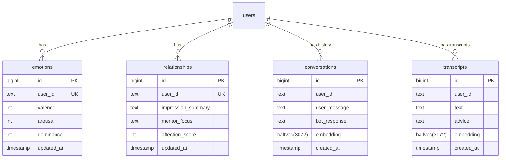

# AImolt Discord Bot

AImoltは、**Gemini** と **Supabase** を活用した、高度な対話能力と長期記憶を持つDiscordボットです。
**NestJS** で構築されており、**Koyeb** 上で常駐プロセスとして動作します。

## 🚀 主な機能

### 1. 高度な対話 (Gemini API)
- **テキスト応答**: 👍リアクションでAIが応答。文脈を理解し、過去の会話や関連情報を踏まえた回答を行います。
- **音声文字起こし**: 🎤リアクションでボイスメッセージや音声ファイルを文字起こし (対応形式: mp3, wav, ogg, m4a, aac)。
- **画像認識**: 画像付きメッセージに対しても内容を理解して応答可能。

### 2. 人格・記憶システム (Personality & Memory System)
AImoltはユーザーとの対話を通じて感情や関係性が変化する「人格」を持っています。

#### ❤️ 感情モデル (VAD Model)
心理学の **VADモデル (Valence, Arousal, Dominance)** をベースに、AIの感情状態を数値化して管理しています。

*   **Valence (感情価)**: ポジティブな会話で上昇、ネガティブな会話で下降。
*   **Arousal (覚醒度)**: 驚きや興奮で上昇、落ち着いた会話で下降。
*   **Dominance (支配性)**: 主体的な会話で上昇、受動的な会話で下降。

**更新ロジック:**
ユーザーのメッセージごとに、Geminiが現在の感情状態と文脈を考慮して「感情の変化量（Delta）」を算出します。
*   変化量は各指標につき **-30 〜 +30** の範囲で判定。
*   現在値が極端な場合は変化を抑制する減衰ロジックを実装。
*   これらは `src/personality/emotion/` モジュールで管理されています。

#### 🤝 理解・メンターシステム (Understanding & Mentor System)
**LLM (Gemini) が会話内容から動的に関係性を分析・更新する**システムです。

*   **Impression Summary**: ユーザーの人物像や現在の状況をAIが分析し、要約して記憶します。
*   **Mentor Focus**: AIが現在どのようなスタンスでユーザーに接すべきか（例: "Listen", "Challenge", "Encourage"）を決定します。
*   **Affection Score**: ユーザーからの感謝や好意的な言葉によって上下する「好感度」スコアです (-100 〜 +100)。

これら一連のサイクルにより、ユーザーの文脈を深く理解し、長期的なメンターやパートナーとして振る舞います。

### 3. ベクトル検索と長期記憶 (Vector Search & Memory)
過去の膨大な会話ログから、現在の文脈に関連する情報を瞬時に検索・想起します。

*   **Embeddings**: `gemini-embedding-001` を使用して全会話・文字起こしデータをベクトル化。
*   **pgvector (halfvec)**: Supabaseの `pgvector` 拡張機能を使用し、`halfvec(3072)` 型で効率的に管理。高速な類似度検索を実現しています。
*   **ハイブリッド検索**:
    *   **Conversations**: 過去のやり取りから関連する文脈を検索。
    *   **Transcripts**: 過去の音声文字起こしデータからも検索可能。

### 4. アドバイス生成 (Advice Generation)
音声文字起こし機能に連動して、ユーザーの発言に対する有用なアドバイスをAIが自動生成します。

*   **Web Search**: `Tavily API` を使用して最新のWeb情報を検索。
*   **Synthesis**: これらを統合し、Geminiが最適なアドバイスを作成してDiscordに返信します。

## 📂 プロジェクト構造

```
aimolt/
├── src/
│   ├── core/                  # Core Services (Gemini, Supabase, Prompt)
│   ├── discord/               # Discord Client & Event Handlers
│   ├── interaction/           # Interaction Logic (Like, Transcribe)
│   ├── personality/           # Personality Engine (Analysis, VAD, Relationship)
│   └── health/                # Health Check Controller
├── Dockerfile                 # Multi-stage build configuration (Node 25-alpine)
├── nest-cli.json              # NestJS config
└── README.md
```

## 🛠️ セットアップ & 開発

### 必須環境
*   Node.js v25+
*   Docker
*   PostgreSQL (Supabase with `pgvector` enabled)

### 環境変数 (.env)
```env
DISCORD_TOKEN=...
GEMINI_API_KEY=...
GEMINI_AI_MODEL="gemini-3-flash-preview"
GEMINI_AI_MODEL_EMBEDDING="gemini-embedding-001"
SUPABASE_URL=...
SUPABASE_KEY=...
TAVILY_API_KEY=...
```

### データベース (Supabase)
本プロジェクトは **Supabase (PostgreSQL)** を活用し、`pgvector` (`halfvec`) によるベクトル検索を実装しています。

#### ER図



### 📦 バックアップとリストア (Backup & Restore)

AImoltは、`pg_dump` などの外部ツールに依存せず、Supabase API (PostgREST) を利用して独自のJSONバックアップを作成します。

#### 自動バックアップ
*   **スケジュール**: 毎日 00:00 (JST)
*   **保存先 (コンテナ内)**: `/app/temp/backup-{YYYY-MM-DD}/`
*   **形式**: テーブルごとの JSON ファイル (`conversations.json`, `transcripts.json` など)
*   **対象テーブル**: `conversations`, `transcripts`, `emotions`, `relationships`
*   **保持期間**: ローカル保存は最新7世代分のみ保持されます（古いものは自動削除）。

#### 手動リストア
バックアップされたJSONファイルからデータベースを復元するためのスクリプトが用意されています。

```bash
# 使用法: npx ts-node src/core/backup/restore.ts <バックアップフォルダのパス>
npx ts-node src/core/backup/restore.ts /app/temp/backup-2024-01-01
```

> **注意**: リストア処理は既存のデータに対して `upsert` を行います。


### ローカル起動
```bash
npm install
npm run start:dev
```

## ☁️ デプロイ (Koyeb)
本リポジトリは **Koyeb** へのデプロイに最適化されています。
GitHub連携後、自動的に `Dockerfile` が検出され、ビルド・デプロイが行われます。

## 🐳 Docker (ローカル実行)
```bash
docker build -t aimolt .
docker run --env-file .env aimolt
```

## 📄 ライセンス
MIT License