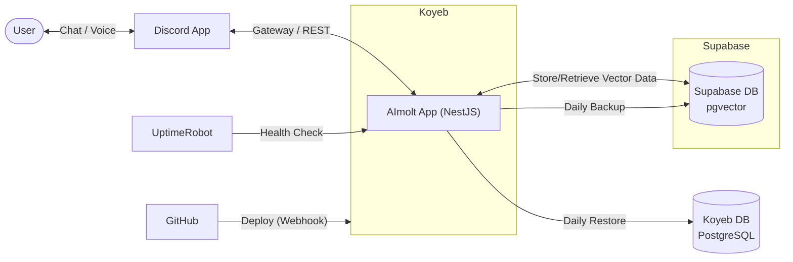
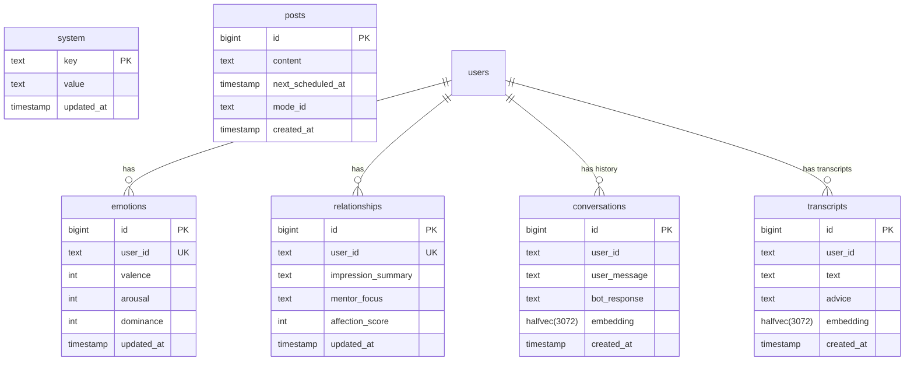

# AImolt is a Discord bot.

AImoltは、**Gemini** と **Supabase** を活用した、高度な対話能力と長期記憶を持つDiscordボットです。
**NestJS** で構築されており、**Koyeb** 上で常駐プロセスとして動作します。

## 💬 高度な対話 (Gemini API)
**AImolt**はユーザーとの対話を通じて感情や関係性が変化する「人格」を持っています。

* **リアクション操作**:
    * **👍 (Like)**: 通常の会話モード。テキストへの返信や、音声の文字起こし＋アドバイスを行います（履歴保存・人格更新あり）
    * **👻 (Ghost)**: 一時的な会話モード。テキストへの返信や、音声の文字起こし＋アドバイスを行いますが、履歴や人格には影響しません
    * **🎤 (Mic)**: 文字起こし専用モード。音声ファイルの文字起こしのみを行います（アドバイスなし・履歴保存なし）
* **対応音声形式**: mp3, wav, ogg, m4a, aac

## ❤️ 感情モデル (VAD Model)
心理学の **VADモデル (Valence, Arousal, Dominance)** をベースに、AIの感情状態を数値化して管理します。

*   **Valence (感情価)**: ポジティブな会話で上昇、ネガティブな会話で下降
*   **Arousal (覚醒度)**: 驚きや興奮で上昇、落ち着いた会話で下降
*   **Dominance (支配性)**: 主体的な会話で上昇、受動的な会話で下降

ユーザーがメッセージに **いいね (👍)** をリアクションした際に、Gemini (LLM) が対象のメッセージと文脈を読み込み、「感情の変化量（Delta）」を高度に推論します。

*   **LLMによる文脈理解**: 単純なキーワードマッチではなく、皮肉や感謝のニュアンス、前後の文脈を考慮して判定
*   **変化量制御**: 各指標につき **-30 〜 +30** の範囲で変化量を算出（極端な感情変動を防ぐロジック）

## 🤝 理解・メンターシステム (Understanding & Mentor System)
**LLM (Gemini) が会話内容から関係性を分析・更新**します。ユーザーの文脈を深く理解し、長期的なメンターやパートナーとして振る舞います。

*   **Impression Summary**: ユーザーの人物像や現在の状況をAIが分析・要約して記憶
*   **Mentor Focus**: AIが現在どのようなスタンスでユーザーに接すべきか（例: "Listen", "Challenge", "Encourage"）を決定
*   **Affection Score**: ユーザーからの感謝や好意的な言葉によって上下する「好感度」スコア (-100 〜 +100)

## 🧠 ベクトル検索と長期記憶 (Vector Search & Memory)
過去の膨大な会話ログから、現在の文脈に関連する情報を瞬時に検索・想起します。

*   **Embeddings**: `gemini-embedding-001` を使用して全会話・文字起こしデータをベクトル化
*   **pgvector (halfvec)**: Supabaseの `pgvector` 拡張機能を使用し、`halfvec(3072)` 型で効率的に管理。高速な類似度検索を実現
*   **Hybrid Search**: AImoltとの過去のやり取りや音声文字起こしデータから関連する文脈を検索

## 💡 アドバイス生成 (Advice Generation)
音声文字起こし機能に連動して、ユーザーの発言に対する有用なアドバイスをAIが自動生成します。

*   **Web Search**: `Tavily API` を使用して最新のWeb情報を検索
*   **Synthesis**: これらを統合し、Geminiが最適なアドバイスを作成してDiscordに返信

## 🦋 Bluesky 自動投稿 (Auto-Posting)
AImoltの「内なる思考」をBlueskyに自動投稿します。

*   **Dynamic Content**: 現在の感情 (VAD)、ユーザーとの関係性、直近の会話内容から、その瞬間の「気持ち」を生成
*   **Privacy First**: 会話内容はGeminiによって抽象化され、個人情報を含まない形で投稿
*   **Scheduling**: 前回の投稿から1時間〜23時間の間隔でランダムに投稿スケジュールを決定
*   **Mode Selection**: 以下のモードから重み付きでランダムに決定（前回と同じモードは非連続）
    *  **今の気分 (30%)**: その瞬間の感情を率直に吐露
    *  **インサイト (25%)**: 最近の会話から得た気づきや哲学的考察
    *  **AI的内省 (20%)**: AIとしての自己認識や問いかけ
    *  **前投稿の続き (15%)**: 前回の内容を深掘り（このモードのみ連続可）
    *  **世界観察 (10%)**: 人間社会や世界についての客観的な感想

## 💻 コマンド

* **`!personality status`**: 現在の感情状態 (VAD) と、ユーザーとの関係性ステータスを表示

## ⚙️ システム構成
AImoltは、Koyeb上で常駐するNestJSアプリケーションを中心に構成されています。

* **Discord App**: ユーザーとAImoltが直接やり取りするチャットプラットフォーム
* **UptimeRobot**: 定期的なアクセスによってアプリケーションを常時稼働させるための外部ヘルスチェック
* **GitHub**: ソースコード管理と、mainブランチへのプッシュを契機としたKoyebへの自動デプロイ
* **Koyeb**: AImoltのNestJSアプリケーションを実行するサーバーレスプラットフォーム
* **Supabase**: メインデータベース。全データ（会話履歴やユーザー情報等）とベクトル検索を使用した長期記憶
* **Koyeb DB**: Supabaseから日次で自動リストア（同期）されるサブデータベース



## 🛠️ セットアップ & 開発

### 必須環境

*   Node.js v25+
*   Docker
*   PostgreSQL (Supabase with `pgvector` enabled)

### 環境変数 (.env)

```env
DISCORD_TOKEN=...
GEMINI_API_KEY=...
GEMINI_AI_MODEL="gemini-3-flash-preview"
GEMINI_AI_MODEL_EMBEDDING="gemini-embedding-001"
GEMINI_AI_MODEL_BLUESKY="gemini-3.1-pro-preview" # Bluesky専用モデル（オプション）
SUPABASE_URL=...
SUPABASE_SECRET_KEY=...
TAVILY_API_KEY=...
BLUESKY_IDENTIFIER=...
BLUESKY_APP_PASSWORD=...

```

### ディレクトリ構造

```
aimolt/
├── src/
│   ├── core/                  # Core Services (Gemini, Supabase, Prompt)
│   ├── discord/               # Discord Client & Event Handlers
│   ├── interaction/           # Interaction Logic (Like, Transcribe)
│   ├── personality/           # Personality Engine (Analysis, VAD, Relationship)
│   └── health/                # Health Check Controller
├── Dockerfile                 # Multi-stage build configuration (Node 25-alpine)
├── nest-cli.json              # NestJS config
└── README.md
```

### データベース

本プロジェクトは **Supabase (PostgreSQL)** を活用し、`pgvector` (`halfvec`) によるベクトル検索を実装しています。



> **Supabaseを初期構築するとき**
> 詳細なセットアップ手順（テーブル作成、RPC関数定義など）は [README_SUPABASE.md](./README_SUPABASE.md) を参照してください。

## ☁️ デプロイ (Koyeb)

本リポジトリは **Koyeb** へのデプロイに最適化されています。
GitHub連携後、自動的に `Dockerfile` が検出され、ビルド・デプロイが行われます。

### バックアップ

AImoltは、**Supabase API (PostgREST)** を利用して独自のJSONバックアップを作成します。また、オプションとして**Koyeb上のPostgreSQL** へ自動的に同期（リストア）します。

*   **スケジュール**: 毎日 00:00 (JST)
*   **プロセス**:
    1.  **Dynamic Backup**: Supabase上の全ユーザー定義テーブルを動的に検出し、データとスキーマ定義 (`schema.json`) をJSONとして保存
    2.  **Auto Restore**: バックアップ完了後、直ちにKoyeb上のPostgreSQLデータベースへ接続し、データをリストア
*   **保存先 (コンテナ内)**: `/app/temp/backup-{YYYY-MM-DD}/`
*   **対象テーブル**: すべてのユーザー定義テーブル (動的検出)
*   **保持期間**: ローカルバックアップファイルは最新7世代分のみ保持（古いものは自動削除）

> Koyebへの自動リストア時は、**既存のデータ（publicスキーマ）を一度完全に削除 (DROP SCHEMA) して作り直します**。これにより、SupabaseとKoyebのデータ状態が完全に同期されます。
> なお、`DATABASE_HOST` 等のKoyeb用環境変数が設定されていない場合、**リストア処理は自動的にスキップされます**（エラーにはなりません）。

### ヘルスチェック

Koyebのヘルスチェックページの **"Last Backup"** 欄には、**Koyebへのリストアが完了した日時** が表示されます。また、**"Last Activity"** 欄には、直近の会話または文字起こしが行われた日時が表示されます。これにより、システムが正常に稼働し、データが同期されているかを確認できます。

## 📄 ライセンス
MIT License